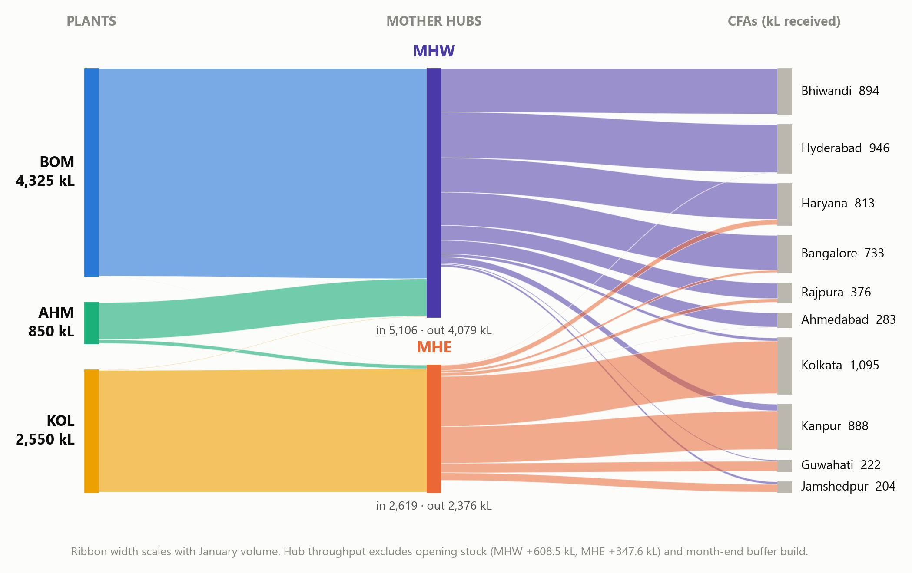
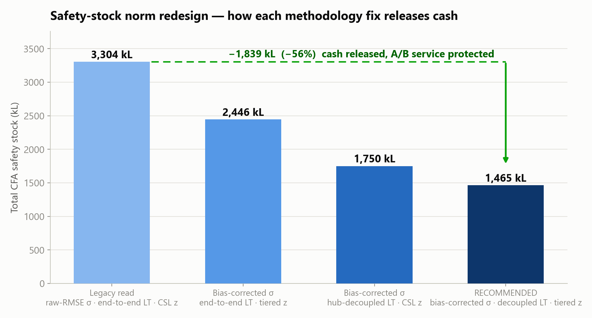

# Levisol Supply Chain Optimization


Monthly production, distribution and inventory planning for a lubricants supply
chain: 3 plants, 2 mother hubs, 10 CFA warehouses and 100 SKUs. The project
covers statistically grounded inventory norms, a cost-optimal production and
routing plan solved as a mixed-integer program, and a planning tool that a
non-technical planner can run every month.



## Results at a glance

| Metric | Value |
|---|---|
| Total cash cost of the January 2026 plan | Rs 114,411,784 |
| Demand unmet | 0 kL of 8,109.7 kL (100% service) |
| Production | 7,725 kL in 309 exact 25 kL batches |
| CFA safety stock vs legacy norms | 1,465 kL (down 56%) |
| Hub safety stock (98% service level) | MHW 1,156 kL, MHE 332 kL |
| Solver optimality gap | 0.0 (proven optimum, cross-checked) |

The plan serves every litre of forecast demand while releasing 1,839 kL of
working capital tied up in the legacy safety-stock norms.



## How it works

1. **Inventory norms.** Safety stock, reorder point and days of cover for all
   957 SKU x CFA combinations plus both hubs. Demand uncertainty comes from the
   bias-corrected standard deviation of forecast errors, lead times follow a
   multi-echelon design (the hub is the decoupling point), and fill-rate targets
   translate to stock tier by tier: cycle-service protection for A/B products,
   exact loss-function sizing for C/D.
2. **Optimization.** A MILP chooses batches per SKU per plant and all
   plant-to-hub and hub-to-CFA flows, minimizing production cost, freight and
   penalty costs. SKUs interact only through production line capacities, so the
   model decomposes exactly by line and each part solves to a proven optimum
   with HiGHS.
3. **Planning tool.** One Excel workbook in, one plan workbook out. Every input
   (demand, capacity, freight rates, lead times, service levels) is editable.
   Capacity shortages come back as a ranked, priced shortage report instead of
   an error.

Full write-up: [docs/methodology.md](docs/methodology.md)

## Quick start

```bash
pip install -r requirements.txt

# reproduce the full January 2026 solution
python scripts/run_solution.py

# or launch the planner GUI
python src/planning_tool.py

# or run headless against any input workbook
python src/planning_tool.py data/case_data.xlsx output/plan.xlsx
```

The solver run takes a few minutes on a laptop. Results land in `output/`
(plan workbook, validation summary).

## Repository layout

```
src/                  planning engine, output writer, planner GUI/CLI
scripts/              reproduction script and smoke test
data/                 case input workbook (exhibits A-J)
docs/                 methodology, tool guide, chart images
deliverables/         final report (pdf/docx), presentation, plan workbook
.github/workflows/    CI: install deps and run the smoke test
```

## Verification

Every number was checked before it shipped:

- All 957 CFA norms and 151 hub norms reproduced by an independent
  implementation to within 1.4e-14 kL
- Feasibility audit: batch multiples, line capacities and mass balances hold
  exactly; all cost components re-derive to under 1e-6 relative error
- Optimality: per-line MILP gap 0.0, confirmed against a monolithic solve and
  an LP lower bound
- Robustness: capacity-shock, demand-spike and freight-shock scenarios run
  end to end through the tool without failures

## Documentation

| Document | Contents |
|---|---|
| [docs/methodology.md](docs/methodology.md) | Formulas, assumptions, verification log |
| [docs/planning-tool-guide.md](docs/planning-tool-guide.md) | Planner-facing user guide |
| [deliverables/report.pdf](deliverables/report.pdf) | Full illustrated report |
| [deliverables/presentation.pptx](deliverables/presentation.pptx) | Presentation deck with speaker notes |

## License

MIT. See [LICENSE](LICENSE).
